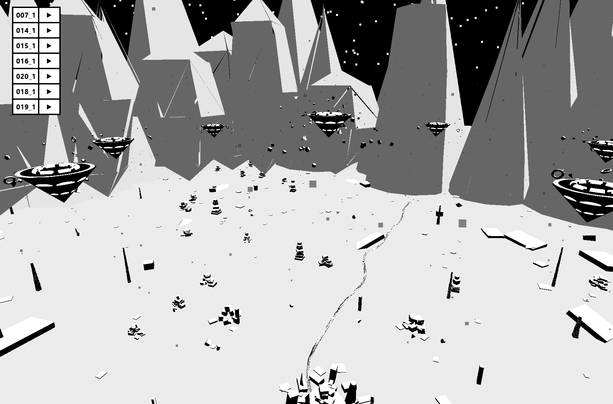

# Geometric Snow

  <div align="center">
      <a href="https://geometric-snow.pages.dev" target="_blank">
          
      </a>
      <br>
      <a href="https://geometric-snow.pages.dev" target="_blank">
          <b>https://geometric-snow.pages.dev</b>
      </a>
  </div>


## Installation

```bash
npm install
```

## Development

```bash
npm run dev
```

Runs the development server on `http://localhost:3000`

## Build

```bash
npm run build
```

Builds the project for production to the `dist/` folder.

## Deployment

The project is configured for static hosting (Cloudflare Pages, Netlify, Vercel, etc.). Simply deploy the contents of the `dist/` folder after building.

### Important Notes for Deployment

- Audio files are located in `public/audio/` and will be copied to `dist/audio/` during build
- The build includes 7 spatial audio tracks totaling ~21MB
- Browser autoplay policies may require user interaction before audio plays

## Tech Stack

- **Three.js** - 3D graphics library
- **TypeScript** - Type-safe development
- **Vite** - Fast build tool and dev server
- **Web Audio API** - Spatial audio via THREE.PositionalAudio

## Project Structure

```
.
├── public/
│   └── audio/          # Audio files (.ogg format)
├── src/
│   └── main.ts         # Main application logic
├── index.html          # Entry HTML file
├── vite.config.ts      # Vite configuration
└── dist/               # Production build output
```
