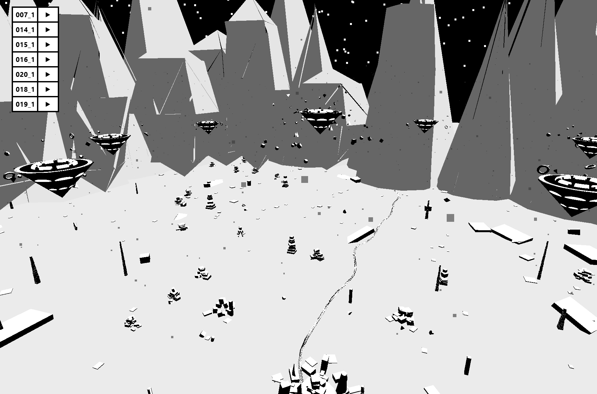

# Geometric Snow

<div align="center">
  <a href="https://geometric-snow.pages.dev" target="_blank">
    
  </a>
  <br>
  <a href="https://geometric-snow.pages.dev" target="_blank">
    <b>https://geometric-snow.pages.dev</b>
  </a>
</div>

An interactive 3D audio-visual experience featuring geometric landscapes, floating diamonds with spatial audio, and falling snow particles.

## Installation

```bash
npm install
```

## Development

```bash
npm run dev
```

Runs the development server on `http://localhost:5173`

## Build

```bash
npm run build
```

Builds the project for production to the `dist/` folder.

## Deployment

The project is configured for static hosting (Cloudflare Pages, Netlify, Vercel, etc.). Simply deploy the contents of the `dist/` folder after building.

### Deployment Notes

- Audio files are located in `public/audio/` (.ogg for desktop) and `public/mobile_audio/` (.m4a for mobile)
- The build includes 7 spatial audio tracks in two formats
- Browser autoplay policies may require user interaction before audio plays

## Tech Stack

- **React** - UI framework
- **React Three Fiber** - React renderer for Three.js
- **@react-three/drei** - Useful helpers for R3F
- **Three.js** - 3D graphics library
- **Zustand** - State management
- **TypeScript** - Type-safe development
- **Vite** - Build tool and dev server

## Project Structure

```
.
├── public/
│   ├── audio/              # Desktop audio files (.ogg)
│   └── mobile_audio/       # Mobile audio files (.m4a)
├── src/
│   ├── main.tsx            # Application entry point
│   ├── components/         # React Three Fiber components
│   │   ├── Scene.tsx       # Main scene composition
│   │   ├── Diamond/        # Diamond components with audio
│   │   ├── CameraController.tsx
│   │   ├── FloatingObjects.tsx
│   │   ├── Mountains.tsx
│   │   ├── ParticleSystem.tsx
│   │   ├── SceneLights.tsx
│   │   ├── Stars.tsx
│   │   ├── Structures.tsx
│   │   └── Terrain.tsx
│   ├── audio/              # Audio management
│   ├── bridge/             # UI-to-store communication
│   ├── hooks/              # Custom React hooks
│   ├── materials/          # Custom Three.js materials
│   ├── store/              # Zustand state store
│   ├── ui/                 # Vanilla JS UI manager
│   └── utils/              # Constants and utilities
├── index.html              # Entry HTML file
├── vite.config.ts          # Vite configuration
└── dist/                   # Production build output
```

## Controls

| Input | Action |
|-------|--------|
| 1-7 | Play audio tracks |
| Z, X, C, V, B, N, M | Focus on diamonds |
| Mouse click | Focus diamond/track |
| Click & drag | Move camera |
| W, A, S, D, E, F | Camera strafe movement |
| Q | Stop all tracks |
| R / ESC | Reset camera to overview |
| P | Play/pause focused track |
| H | Toggle help menu |
